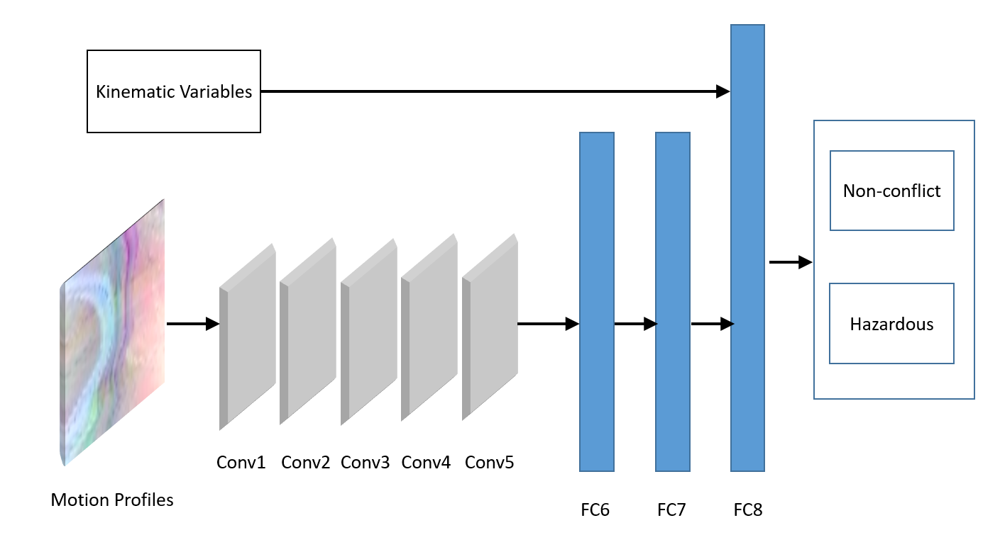

# Multi-modal Net
This project is about driving video analysis and hazardous driving events classification. 
It takes driving video and vehicle driving data as input, and outputs the severity level 0 and 1.
## Algorithm
The structure of multi-modal net:

Kinematic variable are collected from vehicle inertial sensors, including speed, acceleration.

Motion profile shows the trajectory of front vehicle in driving video. More details about
 how motion profile works could be found in [this project](https://github.com/herrsechs/motion_profile) 

## Code
The code contains 6 modules:
* preprocess
* data_IO
* training
* prediction
* statistic
* experiments

The algorithm of this project comes from [paper](https://ieeexplore.ieee.org/document/8569659). 
